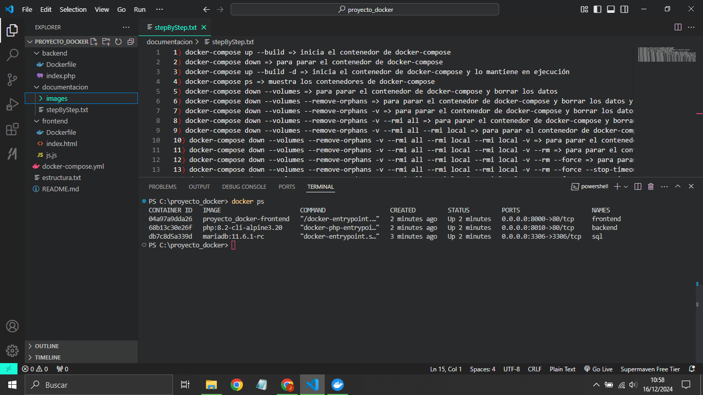
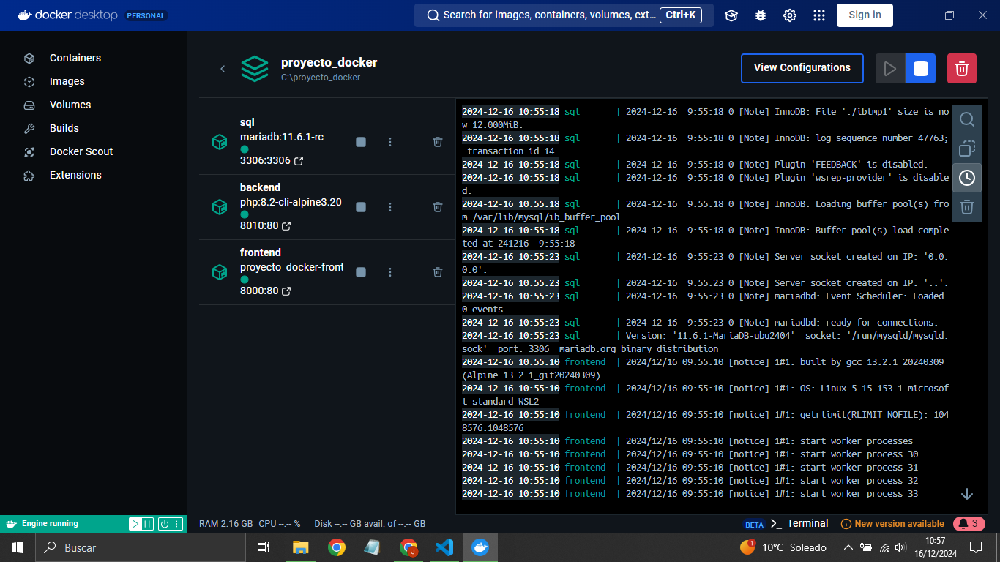
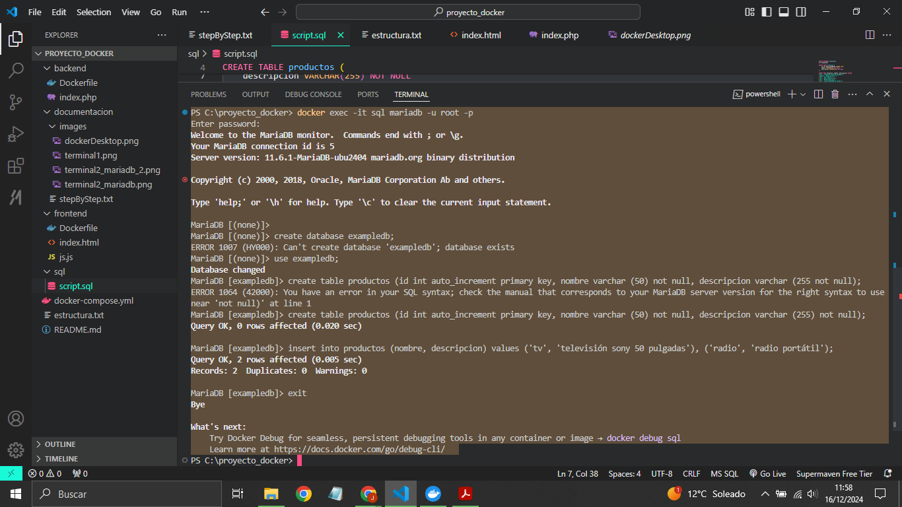
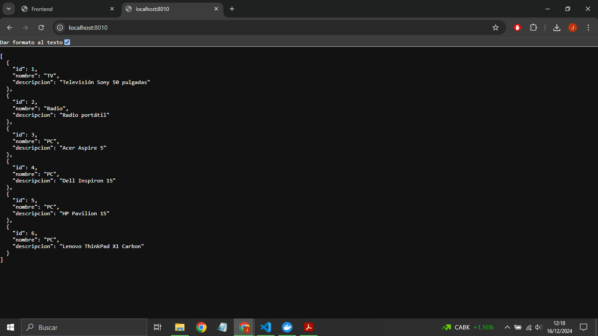
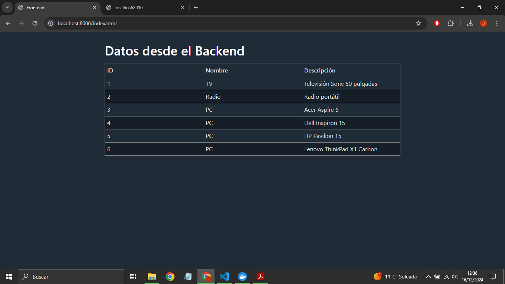

# Autor: Jesús Milla Cabrera

# Proyecto de Contenedores con Docker

Este proyecto implementa un sistema básico con tres servicios:
1. **Frontend**: Un servidor web Nginx que muestra datos obtenidos del backend.
2. **Backend**: Un servidor PHP que se comunica con una base de datos para extraer información.
3. **Base de Datos**: Un contenedor MariaDB para almacenar los datos.

## Requisitos

- Docker y Docker Compose instalados en tu máquina.

## Configuración

1. **Base de datos**: El contenedor MariaDB se inicializa con una base de datos llamada `exampledb` y un usuario `root` con contraseña `root`.

2. **Estructura inicial de la base de datos**:
   Para crear la tabla inicial y agregar datos, ejecuta los siguientes comandos una vez que el contenedor esté en ejecución:

   ```bash
   docker exec -it sql mariadb -u root -p
   ```

## Paso a paso

1) `docker-compose up --build` => Inicia el contenedor de docker-compose.

2) `docker-compose ps` => Muestra los contenedores de docker-compose.



Alternativamente tambien podemos comprobar el estado de los contenedores desde Docker Desktop.



1) `docker exec -it sql mariadb -u root -p` => Para acceder a la base de datos.

Aquí creamos la base de datos, la tabla de productos y añadimos algunos productos a la misma (ver archivo sql/init.sql).

Hacemos todo desde la línea de comandos siguiendo el archivo sql/init.sql



1) Para reiniciar el contenedor de MariaDB:

```bash
docker compose down
```

Detenemos los contenedores de docker-compose y luego los reiniciamos con:

```bash
docker compose up --build -d
```

Probamos el contenedor de backend accediendo a:  
[http://localhost:8010/](http://localhost:8010/)



Probamos el contenedor de frontend accediendo a:  
[http://localhost:8000/](http://localhost:8000/)


